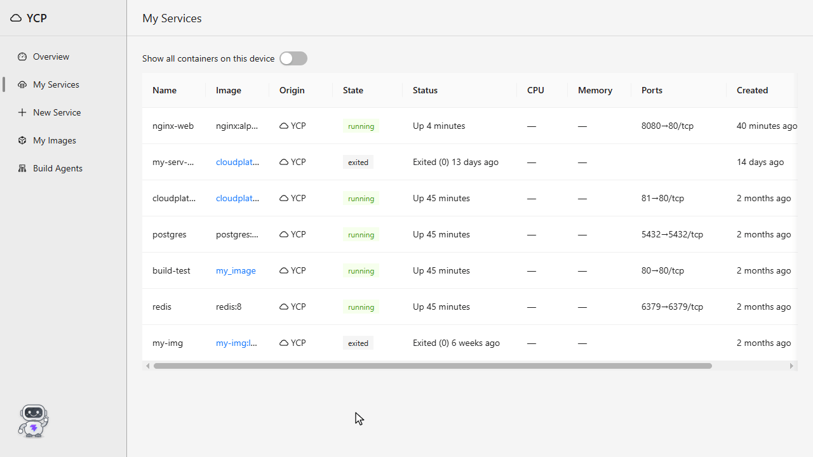

# YCP - Yiftach Cloud Platform

[](https://github.com/Yiftach128/yiftach-cloud-platform/actions/workflows/typecheck-test-and-build.yml)

YCP is a self-hosted cloud control panel for deploying and managing Docker containers from a simple web UI, with Docker daemon as the only source of truth. YCP has live overview of your containers, a variety of managed services you can order, and safe build agents for GitHub repos - so untrusted code can never cause your cloud to crash. 


User can add new services from a ready-made preset (mongoDB, postgres, redis, etc...), any Docker image, or a GitHub repository — and the platform turns it into a running container you can watch, manage, and inspect from the browser. Everything runs locally: as three Node processes on Windows with the Docker daemon living inside WSL2, or as Compose services next to any Docker daemon.

YCP also has a built-in AI assistant: a chat in a side panel. It answers questions from live Docker data and operates the platform for you through an MCP server, and asks for your approval before anything destructive (unless auto-approve mode is on).

The project is split into three standalone packages: a platform backend (with REST API), build agents (microservices that do the image builds from GitHub repos), and a React frontend.

## Features

- **Overview** — a live map of the whole deployment, drawn with ReactFlow: GitHub repo → image → container, with live CPU and memory stats on every container node.

- **My Services** — all your containers in one table with live stats. Start, stop, and delete them, or open a service to see its details, resource usage, and logs (with live updates).

- **New Service wizard** — three ways to create a service: a managed preset (Postgres, Redis, etc, with sensible default ports), any image from a registry, or a GitHub repository.

- **Build Queue** — when you submit a GitHub repo, the client posts a build request to a queue in the backend server. Build agents poll the queue when they're idle and take build jobs off it, so builds never block the API.

- **Build from GitHub** — paste a repo URL (optionally with `#branch` or `#tag`), and a build agent clones it, builds the image with BuildKit, and reports the build log live to your browser. When the build finishes, the container is created and started automatically. If you didn't specify ports, the platform publishes the ports the image exposes on its own.

- **My Images** — every image built by the platform, each with a details page showing its exposed ports and full build provenance: a link back to the source repository, the branch or tag, the exact commit, and the build job that produced it.

- **Build Agents microservices** — the builds run in a separate worker service, not in the API server. You can have several agents polling the job queue. Builds are contained: repos are cloned safely by the microservice instead of on the main backend server, so untrusted code can never cause the app to crash. The Build Agents page shows every agent live via heartbeats — idle, building, or offline, with uptime and last-seen time.

- **Self-healing Docker daemon** — When a request finds the daemon down, the backend boots the WSL distro by itself, and holds the distro open for as long as the server runs.

- **AI assistant** — a chat in a side panel on the right of the screen. Ask about your containers, images and builds and it answers from live Docker data. Ask it to change something and it does, after you approve anything destructive (stop, restart, delete). It runs on a small local model through Ollama, so nothing leaves your machine.

- **MCP server** — the platform's operations (such as: start/stop, inspect, stats, build) are also exposed as MCP tools at `/mcp`, so any MCP client can operate the platform, not only the built-in assistant.


##  The AI assistant



So a chat message flows like this: the browser posts the conversation and reads the reply as a stream. The agent loop sends it to the local model together with the MCP tool list. When the model asks for a tool, the loop runs it through MCP (waiting for your approval first if it is destructive - unless auto-approve mode is on) and hands the result back to the model, until the model answers in plain text.

- **A hand-written agent loop** — the prompt, the budgets and the approval step are code you can read and tune, which a 4B model needs. The model is reached through an `LlmClient` interface (with an Ollama implementation).

- **MCP is the contract between the agent and its tools** — the assistant has no private route to Docker. It uses the same MCP tools an outside client gets at `/mcp`, and those tools call the same services as the REST API.

- **A person approves every destructive call** — stop, restart and delete wait for Approve or Deny in the chat. A denied call is not asked again. An auto-approve switch exists, and it is off in every new tab.

- **Budgets sized for a small model** — at most 6 model calls per message and 5 tool calls per turn. Tool results are shaped for an 8K context window: short ids, MiB instead of bytes, logs capped and trimmed.

- **Every run leaves a trace** — one file per run with exactly what the model was sent and what it answered. Any model call in it can be replayed against the model, without the chat or Docker.

**Evals** — the assistant is scored on 31 cases (did it call the right tools with the right arguments, and does its reply say what the tool results say) across five small local model setups, run with Promptfoo. The model the app runs on, `qwen3:4b-instruct-2507-q4_K_M`, passes 30 of 31. See the [full results table](platform-backend/evals/results/README.md).


## How it works

Three standalone npm packages, no workspaces:

- **`platform-backend/`** — an Express 5 REST API (`/api/v1`) that talks to the Docker daemon through dockerode. It owns the container and image endpoints, the FIFO build queue, and the build-agent registry. It also exposes the same operations as MCP tools at `/mcp` and hosts the AI assistant: the chat endpoint and the agent loop behind it.

- **`builder-service-backend/`** — the build agents microservice that polls the platform server: claim a job → clone the repo → build the image with BuildKit → resolve the ports → create the container through the platform API → report the result. It sends heartbeats the whole time so the UI knows it's alive.

- **`frontend/`** — React UI that only talks to the platform API.

So a GitHub build flows like this: the wizard posts one request with the repo URL and the container config. The platform queues it. An idle build agent claims it, clones the repo, builds the image (reports progress lines back so the browser shows a live log), then asks the platform to create and start the container.

## Tests and CI

- **Unit tests** for the two backends, on Node's built-in test runner with hand-written fakes: no test framework and no mocking library. They need no Docker, Ollama or WSL. Run them with `npm test` in either backend folder.

- **CI** — GitHub Actions runs on every push, one job per package: typecheck and unit tests for each backend, lint and a production build for the frontend.

## Tech stack

**Backend**
- Node.js 24 running TypeScript natively — no build step, the source imports real `.ts` files
- Express 5
- dockerode (Docker Engine API client)
- axios, tar

**Frontend**
- React 19 + TypeScript
- Ant Design 6
- ReactFlow (`@xyflow/react`) for the overview graph
- react-router 8, axios
- Vite 8, oxlint

**Infrastructure**
- Docker with BuildKit, running inside WSL2 Ubuntu
- git CLI for shallow clones

**AI assistant**
- MCP TypeScript SDK v2 (`@modelcontextprotocol/server` and `/client`), with zod for the tool input schemas
- Ollama as the local model server, running `qwen3:4b-instruct-2507-q4_K_M`
- Promptfoo for the evals
- react-markdown for the replies in the chat

**Testing and CI**
- Node's built-in test runner (`node --test`)
- GitHub Actions


## Screenshots

**Overview — the live deployment map**


**My Services — containers with live stats**


**New Service — pick a source**


**New Service — managed preset**


**New Service — build from a GitHub repo**


**Image details — build provenance**


## Getting started

The fastest way to run YCP is Compose, one command. Running from source is the development setup.

### Run with Docker

The whole app — the AI assistant's model server included — runs as Compose services next to the Docker daemon it manages, through the mounted `/var/run/docker.sock`. All it needs is Docker with Compose (no Node.js, no git, no Ollama). Run this in a shell that has `docker` (on a WSL setup, a WSL shell inside the repo folder):

```bash
docker compose up -d --build
```

Then open **http://localhost:3000**. The first `up` downloads about 6 GB — the Ollama image and the assistant's model. Everything except the chat works right away; the chat answers "model not found" until the download is done (`docker compose logs -f ollama-model-pull` shows the progress). Every later `up` takes seconds.

Four services come up: `platform` (the API and the built UI on one port), two `builder` replicas (`docker compose up -d --scale builder=N` changes the count), `ollama` (the model server, no published port, models kept in a named volume) and `ollama-model-pull`, a one-shot download that ends as `Exited (0)`.

**With an NVIDIA GPU** — as written, the model runs on the CPU, so that `up` works on any machine; expect minutes per answer. To give Ollama the GPU, install the [NVIDIA Container Toolkit](https://docs.nvidia.com/datacenter/cloud-native/container-toolkit/latest/install-guide.html) next to Docker (in WSL: inside the distro) and put `OLLAMA_RUNTIME=nvidia` in a `.env` file next to `docker-compose.yml`. `docker exec ycp-ollama-1 ollama ps` shows whether the model landed on the GPU (`100% GPU`). The first chat after a start waits about a minute while the model loads.

Good to know:

- The UI is published on `127.0.0.1` only, on purpose — the API has no login and controls Docker, so it must not be reachable from the network.
- Port 3000 taken? Put `YCP_PORT=3080` in that same `.env` file.
- `OLLAMA_MODEL=<tag>` in the `.env` swaps the assistant's model, for the platform and the download together; the model must support tool calling.
- The YCP containers (`ycp-platform-1`, `ycp-builder-1`, …) are not platform-managed, so My Services lists them only with "Show all containers on this device" turned on. Stopping `ycp-platform-1` from there stops the UI itself — bring it back with `docker compose up -d`.

### Prerequisites (running from source)

- Windows with **WSL2** and an Ubuntu distro
- **Docker** installed inside WSL2, with the daemon listening on `tcp://127.0.0.1:2375` (bind IPv4 explicitly; WSL's localhost relay does not forward IPv6 listeners)
- **Node.js 24** or newer
- **git** on your PATH (the build agent uses it for cloning)
- Optional, for the AI assistant: **[Ollama](https://ollama.com)** on `127.0.0.1:11434` (inside the WSL distro works) with the model pulled: `ollama pull qwen3:4b-instruct-2507-q4_K_M`. Without it everything else runs, and the chat says the model server is unavailable.

### Install

```bash
git clone https://github.com/Yiftach128/yiftach-cloud-platform.git
cd yiftach-cloud-platform

cd platform-backend && npm install && cd ..
cd builder-service-backend && npm install && cd ..
cd frontend && npm install && cd ..
```

### Configure

Both backends have a `.env.example` you can copy to `.env`. Every variable is optional — the defaults are made for local development. The ones you might touch:

| Variable | Package | Default | What it does |
|---|---|---|---|
| `PORT` | platform-backend | `3000` | API port |
| `DOCKER_HOST` | both backends | `tcp://127.0.0.1:2375` | Where the Docker daemon lives — `tcp://host:port`, or `unix:///var/run/docker.sock` when running next to the daemon with its socket mounted |
| `ALLOWED_HOSTS` | platform-backend | `localhost,127.0.0.1` | Hostnames a request's `Host` (and browser `Origin`) header may name — anything else gets 403 |
| `OLLAMA_URL` | platform-backend | `http://127.0.0.1:11434` | Where the AI assistant's model server (Ollama) listens |
| `OLLAMA_MODEL` | platform-backend | `qwen3:4b-instruct-2507-q4_K_M` | The model the assistant runs on — pulled in Ollama, with tool-calling support |

### Run

Open three terminals:

```bash
# 1 — the platform API (port 3000)
cd platform-backend && npm run dev

# 2 — a build agent (no port, it polls the platform)
cd builder-service-backend && npm run dev

# 3 — the frontend (port 5173, proxies /api to the backend)
cd frontend && npm run dev
```

Then open **http://localhost:5173**.

You don't need to start WSL yourself — the first request that finds the daemon down boots it automatically (a cold start takes around 10 seconds).


## Future work

- **Evals** — turn the existing chat traces into eval cases with a command (today a trace is copied into a case by hand), and add a hosted LLM judge that scores a reply on its meaning, not only on the values it must mention.

- **Prompt improvement** — measure changes to the system prompt wording with the evals.

- **A hosted model** — an `LlmClient` for a hosted provider (like Anthropic or OpenAI).

- **Frontend tests** — Vitest.
